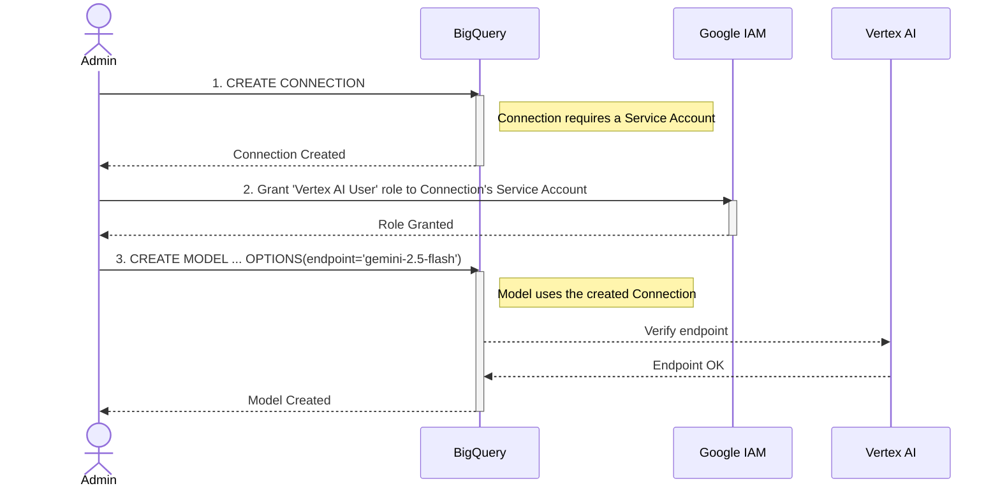
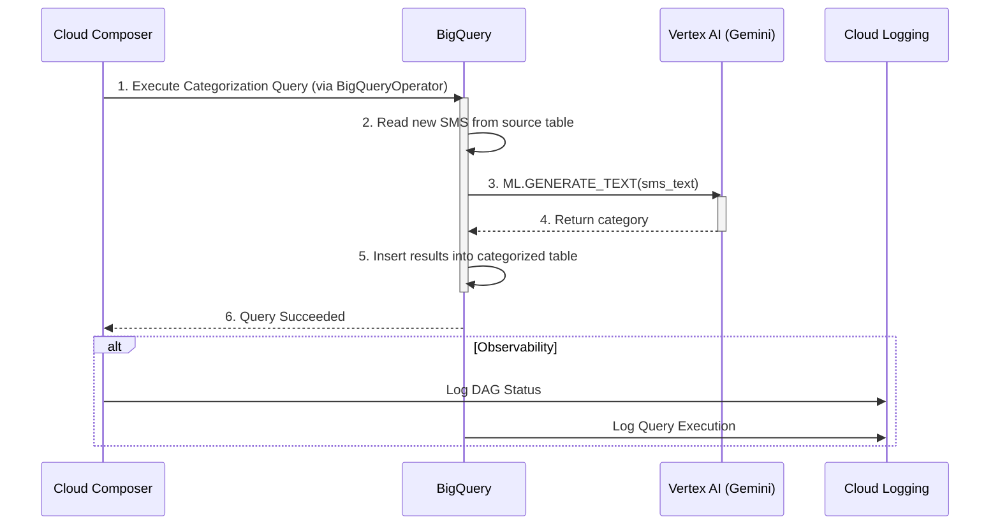

#  SMS Categorisation using Gemini and BigQuery

This document outlines the process for automatically categorizing SMS messages for Admiral Insurance using Google Cloud's AI platform, Vertex AI, and BigQuery.

## Goal

The primary goal is to classify incoming SMS messages into meaningful categories (e.g., "claim update," "policy renewal," "marketing," "payment reminder"). This will enable data science and analytics teams to easily analyze and derive insights from the SMS data stored in BigQuery.

## Diagrams

### 1. One-Time Setup Sequence Diagram

This diagram shows the manual steps an administrator performs to connect BigQuery to Vertex AI.



#### Setup Steps Description
1.  **Create Connection:** The administrator executes a `CREATE CONNECTION` command in BigQuery. This creates a secure connection resource that BigQuery can use to communicate with external services, in this case, Vertex AI. This connection is associated with a specific Google Cloud Service Account.
2.  **Grant IAM Role:** The administrator grants the `Vertex AI User` IAM role to the Service Account associated with the newly created connection. This permission is necessary for the connection to be able to invoke the Gemini model endpoint in Vertex AI.
3.  **Create Model:** The administrator runs a `CREATE MODEL` command in BigQuery. This command creates a remote model that acts as a proxy to the `gemini-2.5-flash` model on Vertex AI. The model specifies the connection to use and the target Vertex AI endpoint. BigQuery verifies the endpoint before successfully creating the model.

### 2. Daily Process Sequence Diagram

This diagram illustrates the daily automated workflow, orchestrated by Cloud Composer.



#### Daily Process Steps Description
1.  **Execute Query:** Triggered by its daily schedule, the Cloud Composer DAG executes a `BigQueryOperator`. This operator runs a predefined SQL query in BigQuery to start the categorization process.
2.  **Read New SMS:** The BigQuery query first selects the new, unprocessed SMS messages from the source table. This is the "delta" to be processed for the day.
3.  **Generate Text:** For each new SMS, the query calls the `ML.GENERATE_TEXT` function, passing the SMS content to the remote model created during the one-time setup. BigQuery, via the connection, sends this data to the Vertex AI Gemini endpoint.
4.  **Return Category:** The Gemini model processes the SMS text and returns the predicted category (e.g., "Claim Update") back to BigQuery.
5.  **Insert Results:** The query takes the returned category and inserts it, along with the original SMS data, into the destination `categorized_sms` table.
6.  **Query Succeeded:** Once the query completes successfully, BigQuery reports the success back to the `BigQueryOperator` in Cloud Composer, which marks the task as complete.

#### Observability
- **Cloud Logging:** Throughout the process, both Cloud Composer and BigQuery send logs to Cloud Logging. This includes the status of the Composer DAG (e.g., success, failure) and the details of the BigQuery job execution, providing a complete audit trail.
- **Cloud Monitoring:** The logs and metrics captured in Cloud Logging can be used to build dashboards and alerts in Cloud Monitoring to track the health and performance of the pipeline.

---

## Example SQL Statements

### `CREATE MODEL` Statement
```sql
CREATE OR REPLACE MODEL `admiral_sms_cat.sms_categorizer`
REMOTE WITH CONNECTION `projects/your-gcp-project/locations/your-region/connections/vertex-ai-connection`
OPTIONS (endpoint = 'gemini-2.5-flash');
```

### `INSERT` Statement with `ML.GENERATE_TEXT`
```sql
INSERT INTO `admiral_sms_cat.categorized_sms` (sms_id, sms_text, category)
SELECT
  sms_id,
  sms_text,
  ml_generate_text_result['predictions'][0]['content'] AS category
FROM
  ML.GENERATE_TEXT(
    MODEL `admiral_sms_cat.sms_categorizer`,
    (
      SELECT
        sms_id,
        sms_text,
        'Categorize the following SMS message into one of the following categories: "Claim Update", "Policy Renewal", "Marketing", "Payment Reminder", "General Inquiry". SMS: ' || sms_text AS prompt
      FROM
        `admiral_sms_raw.sms_messages`
      WHERE
        -- Logic to select only new messages
        sms_id NOT IN (SELECT sms_id FROM `admiral_sms_cat.categorized_sms`)
    ),
    STRUCT(
      0.2 AS temperature,
      1024 AS max_output_tokens
    )
  );
```
