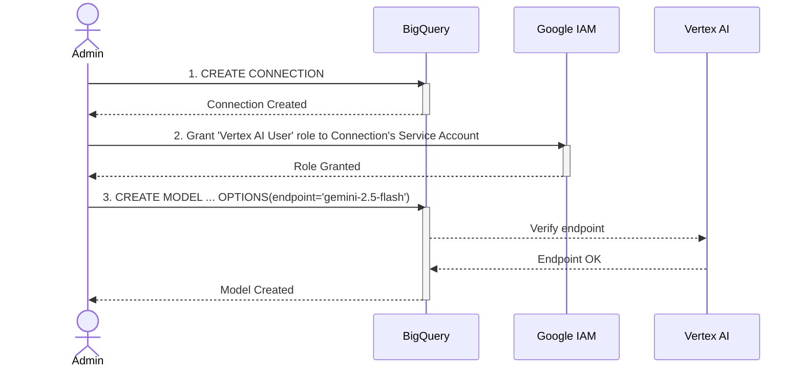
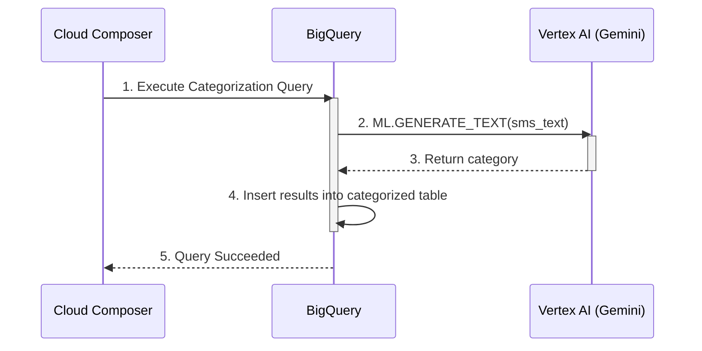
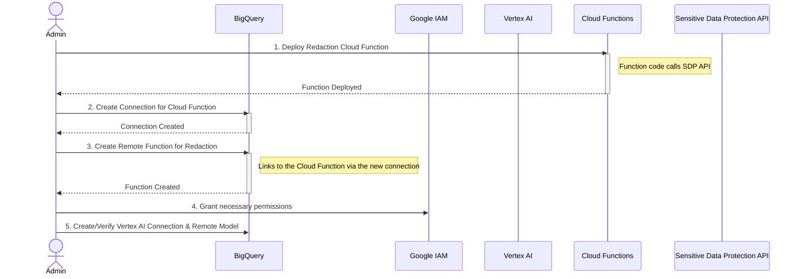
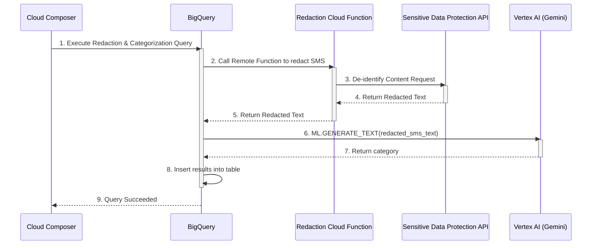

# Admiral SMS Categorisation using Gemini and BigQuery

This document outlines the process for automatically categorizing SMS messages for Admiral Insurance using Google Cloud's AI platform, Vertex AI, and BigQuery. The project is divided into two phases.

- **Phase 1: Direct Categorization:** A proof-of-concept to validate the categorization of SMS messages without handling sensitive data.
- **Phase 2: Categorization with Redaction:** The production-ready approach that introduces a redaction step using the Sensitive Data Protection (SDP) API to protect customer data before categorization.

## Goal

The primary goal is to classify incoming SMS messages into meaningful categories (e.g., "claim update," "policy renewal") while ensuring sensitive customer information is redacted before being processed by the AI model. This enables data analysis while maintaining data privacy.

---

## Phase 1: Direct Categorization (Proof of Concept)

This phase focuses on the core functionality of connecting BigQuery to Vertex AI to categorize SMS messages directly. The purpose is to quickly validate the effectiveness of the AI model for categorization before building a more complex, production-ready pipeline.

### One-Time Setup Diagram (Phase 1)



#### Setup Steps Description
1.  **Create Connection:** An administrator executes the `bq mk` command in the gcloud CLI to create a connection. **Why:** This is the foundational step that creates a secure, reusable channel for BigQuery to communicate with external GCP services like Vertex AI, without exposing credentials in code. An appropriate GCP project and region must be selected for the connection.
    ```bash
    bq mk --connection --location=REGION --project_id=PROJECT_ID \
        --connection_type=CLOUD_RESOURCE CONNECTION_ID_VAI
    ```
2.  **Grant IAM Role:** The administrator grants the `Vertex AI User` IAM role to the connection's Service Account. **Why:** This is a critical security measure that follows the principle of least privilege. It ensures the connection is only authorized to perform its specific task (invoking the AI model) and nothing else.
3.  **Create Model:** The administrator runs a `CREATE MODEL` command in BigQuery. **Why:** This step abstracts the complexity of a direct API call into a simple, reusable SQL function. It empowers data analysts to leverage powerful AI models using familiar SQL, without needing to write complex application code.

### Daily Process Diagram (Phase 1)



#### Daily Process Steps Description
1.  **Execute Query:** A Cloud Composer DAG, running on a daily schedule, triggers a `BigQueryOperator`. **Why:** Using an orchestrator like Cloud Composer ensures the process runs reliably and automatically on a schedule, with built-in logging and retry mechanisms.
2.  **Generate Text:** The query calls the `ML.GENERATE_TEXT` function, sending the raw SMS text to the Gemini model. **Why:** This is the core value-add of the solution, where the AI model is invoked seamlessly from within the data warehouse, bringing AI capabilities directly to the data.
3.  **Return Category:** The Gemini model processes the text and returns a predicted category. **Why:** This is the output of the AI's analysis, providing the structured, classified data that is the goal of the project.
4.  **Insert Results:** The query inserts the original SMS and its new category into a results table. **Why:** Storing the results creates a clean, analyzed dataset. This prevents re-processing the same data and provides a ready-to-use table for dashboards and analytics.
5.  **Query Succeeded:** BigQuery reports the successful completion back to Cloud Composer. **Why:** This feedback is essential for the orchestrator to know the task is complete, log the success, and trigger any downstream dependencies.

---

## Phase 2: Categorization with Redaction (Production)

This phase enhances the process by integrating the Sensitive Data Protection (SDP) API to redact sensitive information (PII) from SMS messages *before* they are sent to the Gemini model. This is the production-ready approach that ensures data privacy and compliance.

### One-Time Setup Diagram (Phase 2)



#### Setup Steps Description
1.  **Deploy Cloud Function:** An administrator deploys a Cloud Function that contains code to call the SDP API. **Why:** BigQuery cannot call the SDP API directly. The Cloud Function acts as a lightweight middleware, bridging the gap between a SQL query and the redaction service.
2.  **Create Connection for Cloud Function:** A second, separate connection is created using the `bq mk` command. **Why:** Just as a connection is needed for Vertex AI, a dedicated, secure channel is required for BigQuery to be able to invoke the new Cloud Function. This command registers the connection with BigQuery, making it available for use in remote functions. An appropriate GCP project and region must be selected.
    ```bash
    bq mk --connection --location=REGION --project_id=PROJECT_ID \
        --connection_type=CLOUD_FUNCTION CONNECTION_ID_CF
    ```
3.  **Create Remote Function:** The administrator creates a `REMOTE FUNCTION` in BigQuery. **Why:** This abstracts the call to the Cloud Function into a simple, reusable SQL function (e.g., `redact_sms()`). This makes the entire redaction process easily accessible within any BigQuery query.
4.  **Grant Permissions:** The administrator grants IAM roles to allow BigQuery to invoke the Cloud Function (`Cloud Function Invoker`) and for the Cloud Function to call the SDP API (`SDP User`). **Why:** This multi-stage permissioning ensures the entire chain of operations is secure and adheres to the principle of least privilege.
5.  **Create Vertex AI Model:** The setup from Phase 1 is still required. **Why:** Redaction and categorization are two distinct steps. The remote model for Vertex AI is still needed for the final classification step after the data has been redacted.

### Daily Process Diagram (Phase 2)



#### Daily Process Steps Description
1.  **Execute Query:** The daily Cloud Composer DAG triggers a more advanced BigQuery query. **Why:** The orchestration remains the same, but the underlying SQL is now responsible for both redaction and categorization.
2.  **Call Remote Function:** The query first calls the `redact_sms()` remote function for each new SMS. **Why:** This is the crucial first step of the production workflow, ensuring data is cleaned *before* any further processing.
3.  **De-identify Content:** The Cloud Function sends the SMS text to the Sensitive Data Protection API. **Why:** This delegates the complex and critical task of finding and masking PII to a specialized, managed Google Cloud service.
4.  **Return Redacted Text:** The SDP API returns the text with sensitive data replaced by placeholders (e.g., `[PHONE_NUMBER]`). **Why:** This is the clean, anonymized data that is safe to use in the next stage.
5.  **Return Redacted Text to BQ:** The Cloud Function passes the clean text back into the running BigQuery query. **Why:** This makes the redacted data available for the next step in the same query, creating a seamless flow.
6.  **Generate Text:** The query calls `ML.GENERATE_TEXT`, but this time with the *redacted* SMS text. **Why:** This is the most critical step for data privacy. It ensures that no PII is ever sent to or processed by the generative AI model, mitigating privacy risks.
7.  **Return Category:** The Gemini model returns a category based on the non-sensitive parts of the message. **Why:** The model can still effectively classify the message's intent (e.g., "claim update") without needing to know the specific personal details.
8.  **Insert Results:** The query inserts the original SMS, the redacted SMS, and the category into the results table. **Why:** Storing all three pieces of information provides a complete audit trail. It allows for analysis of the redaction process itself while providing the clean, categorized data for general business analytics.
9.  **Query Succeeded:** BigQuery reports the successful completion of the multi-step query back to Composer. **Why:** This confirms that the entire, more complex workflow has finished successfully.

```
